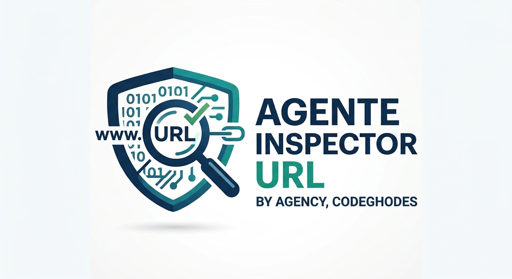

# 🕵️‍♂️ AGENTE INSPECTOR URL
### BY AGENCY, CODEGHODES • Ciberseguridad, Meta Ads, Tráfico & Benchmark Suite

<p align="center">
  
</p>

<p align="center">
  <strong>Plataforma 360° para escaneo forense de URLs, auditoría de campañas de Meta Ads, inteligencia de tráfico, detección de vulnerabilidades y benchmark competitivo 1 vs 1.</strong>
</p>

<p align="center">
  
  
  
  
</p>

---

## ⚡ Capacidades Principales

1. **🚀 Auditoría Integral de Meta Ads & Landing Pages:**
   - Detección de **Píxel de Meta (`fbq`)**, Google Analytics 4 (`gtag`), TikTok Pixel y AdSense.
   - Generación de **6 recomendaciones CRO** y **5 anuncios adaptados al rubro**.
   - **Guiones de video para Reels** y simulador interactivo de presupuesto y ROAS.

2. **⚔️ Comparador de Competidores (Benchmark 1 vs 1):**
   - Enfrentamiento directo entre la URL de tu cliente y su rival.
   - Matriz de ventajas competitivas, brechas de velocidad y nivel de ciberseguridad.

3. **📱 Vista Previa en WhatsApp & Redes Sociales (Open Graph):**
   - Mockup visual interactivo que simula cómo se ve el enlace al compartirlo en WhatsApp.

4. **🛡️ Escáner Forense de Ciberseguridad & Servidores:**
   - Detección de **Cortafuegos WAF & Anti-DDoS** (Cloudflare, AWS WAF, Sucuri, Fastly).
   - **Certificado SSL**: Emisor, fecha de vencimiento y días restantes.
   - Cabeceras de seguridad (`HSTS`, `X-Frame-Options`, `X-Content-Type-Options: nosniff`).

5. **📜 Verificación Legal en Meta (DNS TXT):**
   - Comprobación del registro público `facebook-domain-verification` en servidores DNS.

6. **⚖️ Privacidad y Cumplimiento Normativo (GDPR / Meta Ads):**
   - Detección de Política de Privacidad y banners de consentimiento de cookies.

7. **🕵️‍♂️ Integración con el Agente Inspector de Código:**
   - Auditoría de código Python/JavaScript, detección de secretos expuestos y OWASP Top 10.

---

## 💻 Inicio Rápido Local (Sin Dependencias / 100% Offline)

### En Linux / macOS:
```bash
./iniciar.sh
```
Abre automáticamente tu navegador en `http://localhost:3005`.

### En Windows:
Doble clic en `iniciar.bat`.

---

## ☁️ Despliegue en la Nube (Vercel)

1. Importa este repositorio en [vercel.com](https://vercel.com).
2. Haz clic en **Deploy**.
3. ¡Listo! El archivo `vercel.json` ya está configurado para despliegue serverless instantáneo.

---

<p align="center">
  <strong>Desarrollado con ❤️ por AGENCY, CODEGHODES & INFORMATIC@SUR</strong>
</p>
